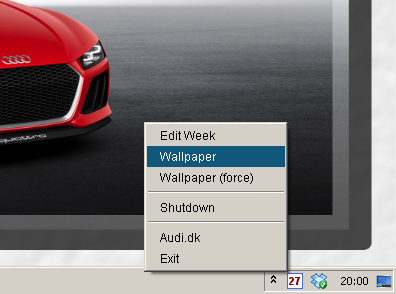

Tray
====

Tray is a small Java application targeted Windows Systems, that places an icon in the Windows System Tray to show the
current date. Further more it tracks start- and stop times and can show a status based on timestamps.

<p align="center">
  <br>
  <i>Shows icon in the tray showing the date and the popup-menu activaed</i><br><br>
  <br>
  <i>Shows the time tracker window that calculates times and remaining work-estimates</i><br>
</p>

Features
--------

+ Java application
+ Shows current Date in an icon in the System Tray (Windows Systems)
+ Stamps simple textfiles upon launch and exit (to use for time tracking)
+ Counts hours from the timestamps and show status for the week
+ Advanced wallpaper generation with small calendars and the monthly image from audi.dk calendar

Dependencies
------------

Tray depends on a couple of external components to achieve its functionality.

+ JDIC (Java Desktop Integration Components). These are for accessing various Desktop
  elements from Java. The System Tray and the possibility to change wallpaper
+ Launch4J (For wrapping the Java Application as an .exe file).


JDIC Integration
----------------

java.library.path should point to a location with the JDIC dll's.

Example VM parameter:

```
-Djava.library.path=D:\Projects\Shell\Modules\Tray\build\dist\lib
```

Development
-----------

IntelliJ Project files are not committed to Git. In order to get IntelliJ working with Tray all you should do is create a new plain Java-project in the Tray directory.

+ Change src-folders to include `src/main/java` and `src/main/resources`
+ Change test-folders to include `src/test/java`
+ Add `lib\jdic\jdic_misc.jar` to dependencies (F4 > Modules > Dependencies)
+ Go to a Test, e.g. `src/test/ModelTest` and press Alt+Enter at one of the failing @Test directives and select "Add 'JUnit4' to classpath" (Just use the distribution with IntelliJ)
+ Add build.xml under the Ant tab
+ In the Ant-tab add the `lib/launch4j/Launch4j.jar` as additional classpath to Ant (Alt+Enter, then Additional Classpath Tab)
+ Build the resources.jar (ant target `pack(jar)`)
+ Add the newly build `build\dist\lib\resources.jar` to dependencies (F4 > Modules > Dependencies)
+ Right Click on e.g. `TestMain.java` and select Run

